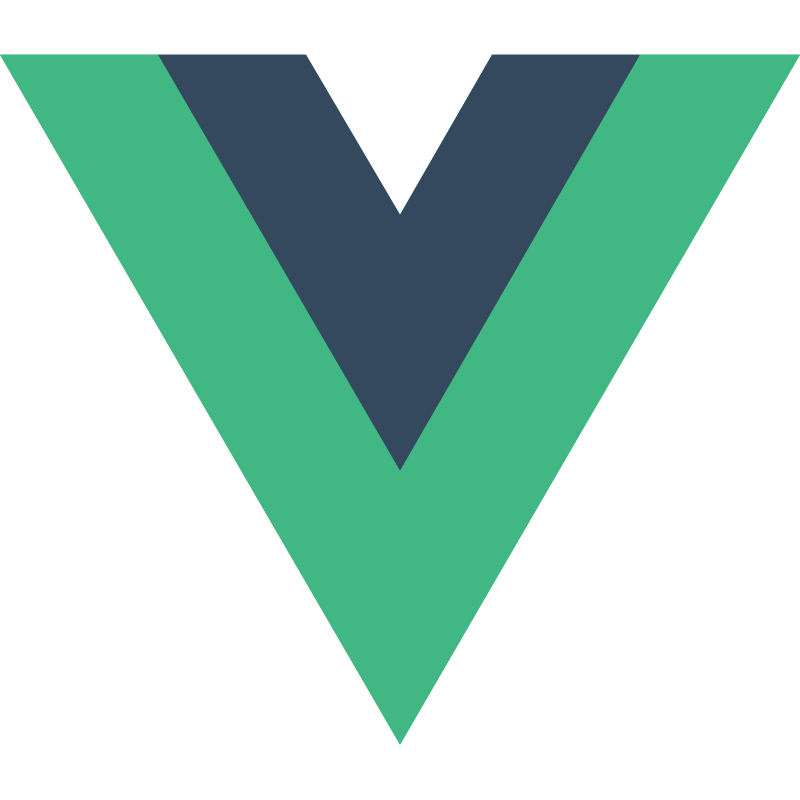

# 👋 Hi there I'm Masato

    

---

## 🛠️ My Skills

### 🎨Web / Frontend / Frameworks

  
  
  
  
  
  
  
  
  
  

### ⚙️ Backend / APIs / Frameworks

  
  
  
  
  
  
  

### 🗄️ Database / ORM / Storage

  
  
  
  

### ☁️ Cloud Platforms

  
  
  

### DevOps / Infra / Tools

  
  
  
  
  
  
  

### Development Tools

  
  

### Design & Analytics

  
  

<!--
**NewM07x2/NewM07x2** is a ✨ _special_ ✨ repository because its `README.md` (this file) appears on your GitHub profile.

Here are some ideas to get you started:

🔭 I’m currently working on ...
🌱 I’m currently learning ...